# 本地文本搜索定位器
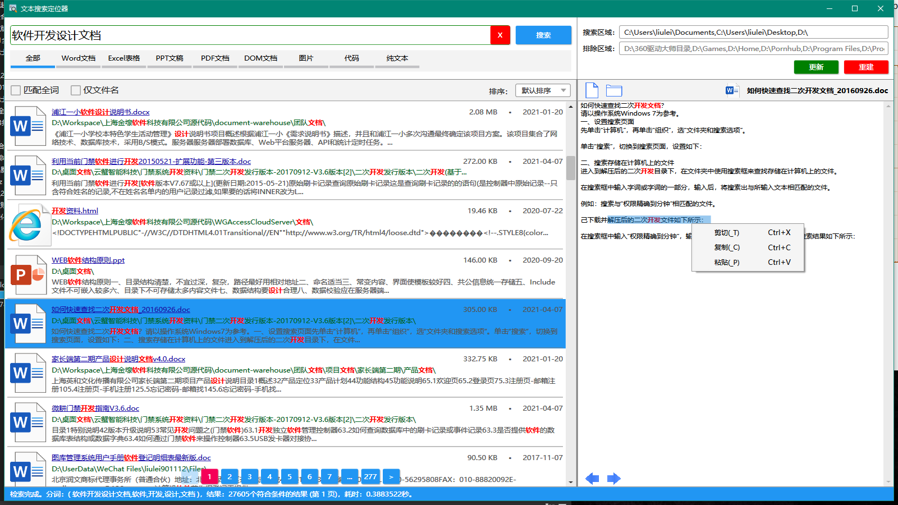

## 提示：发行版zip包在[gitee](https://gitee.com/liulei901112/TextLocator)下，[github](https://github.com/liulei901112/TextLocator)只是同步了代码
## 欢迎有兴趣和想法的开发者加入，为项目舔砖加瓦。

#### 软件介绍
基于.net实现的本地文档的全文索引定位器，根据关键词搜索定位本地文档内容。便于查找历史文档时节省时间，本地文档全文搜索神器！

#### 软件架构
本地单机软件。
* WPF实现的UI（RubyerUI组件）
* Lucene.Net实现的索引（Jieba.NET分词器）
* NetOffice、OpenXML、NPOI、Spire实现的文档内容解析

#### 安装教程
* 运行环境基于.net freamwork 4.6.1（需要安装此环境才能运行）
* 发布版下载解压可用（或自己下载源码编译）

#### 操作演示

#### 软件截图
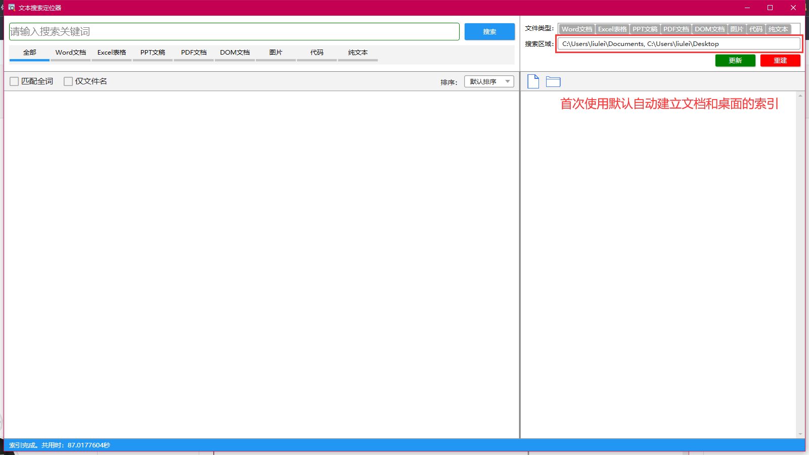
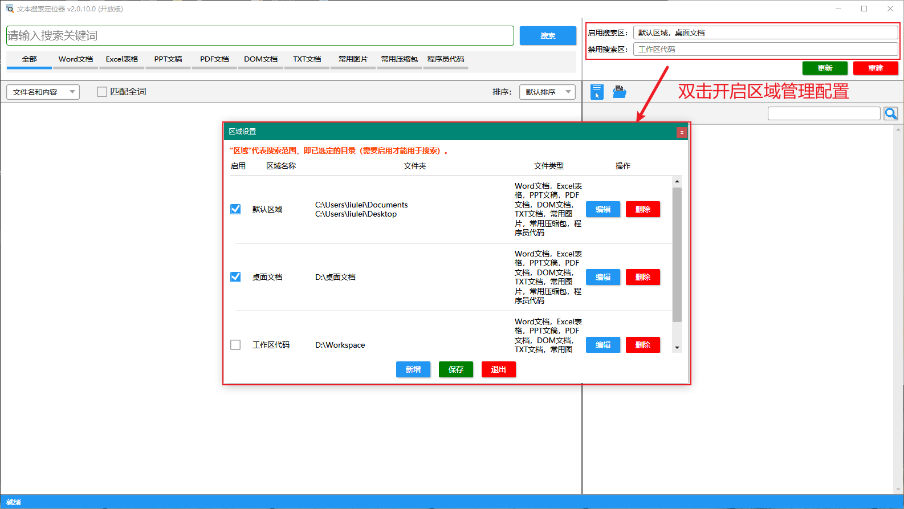
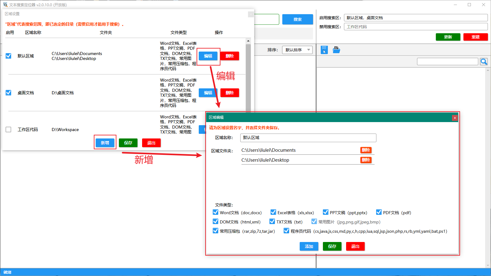
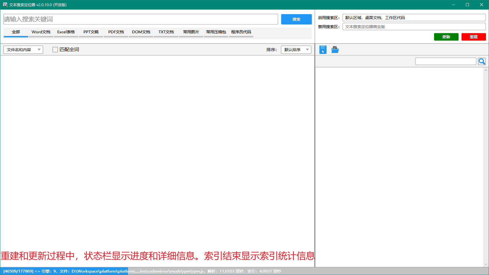
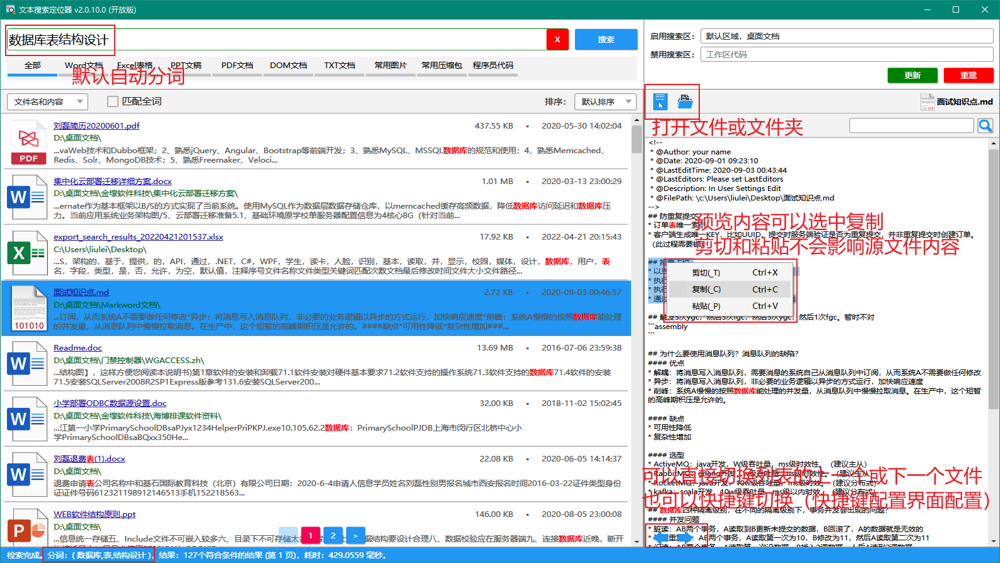

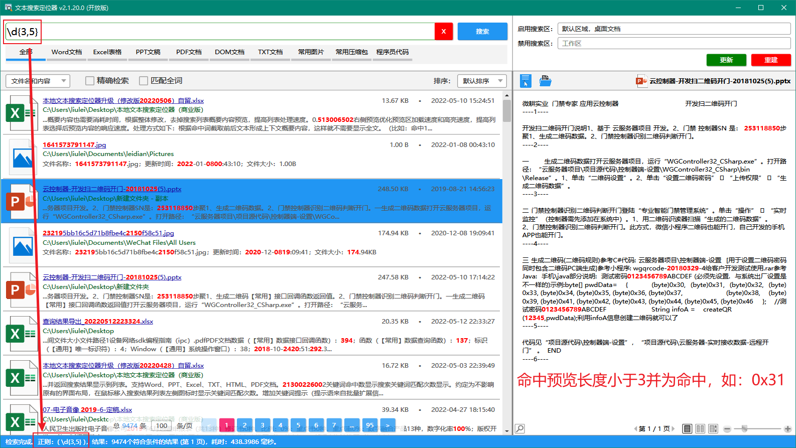
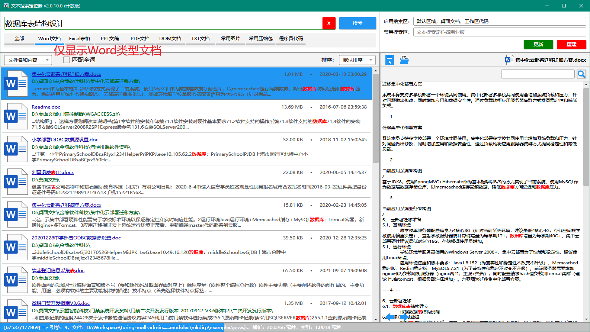
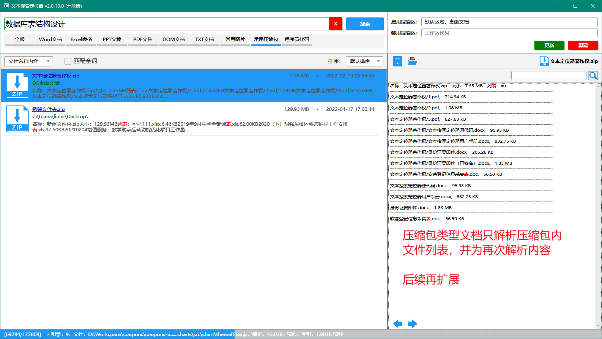
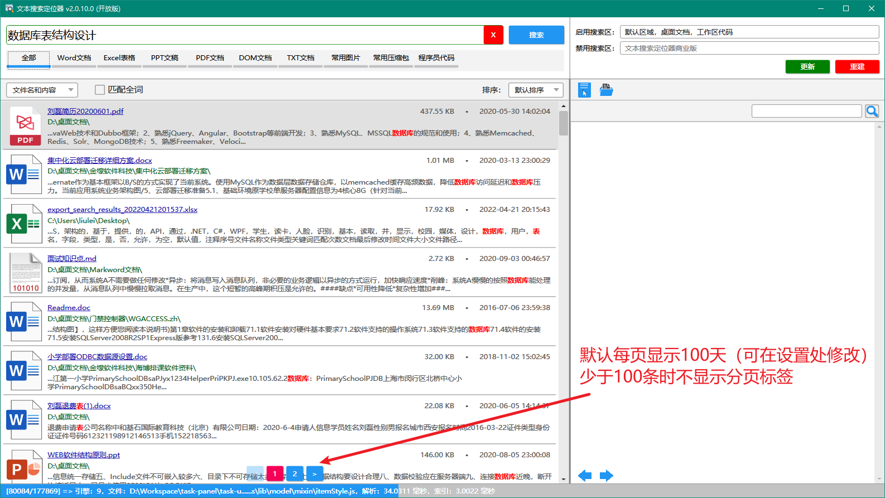
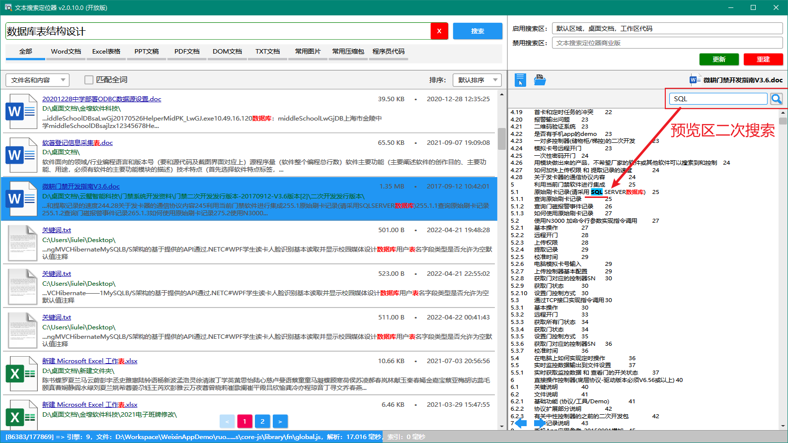
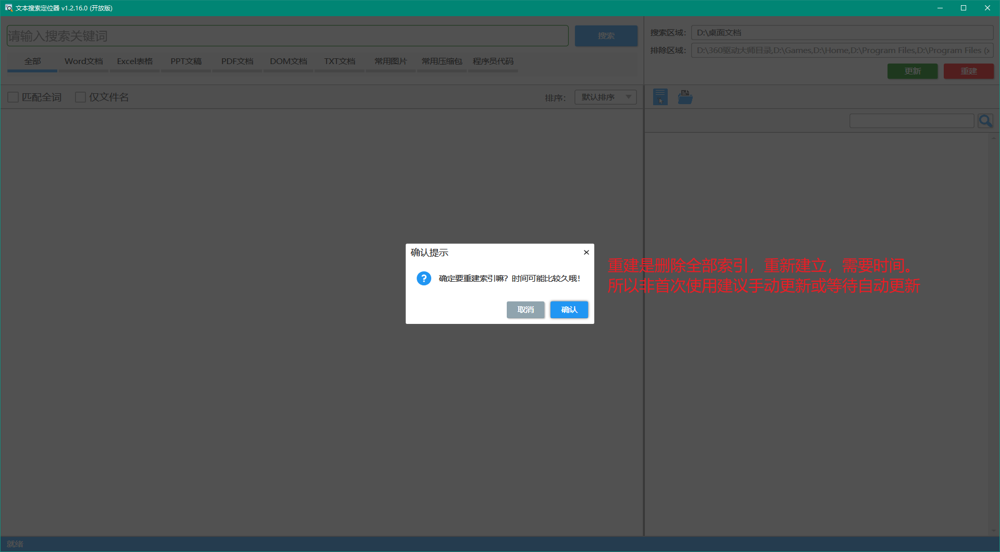
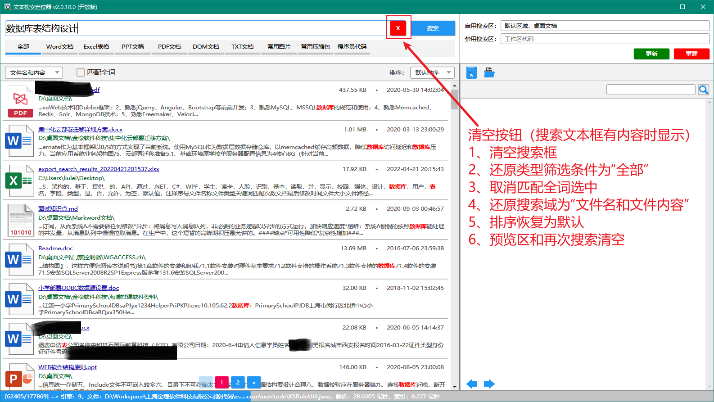

#### 使用说明
1. 双击文件夹设置自己需要搜索的文件夹（和排除的文件夹）
2. 点击“重建”按钮创建文档索引，更新文档索引点击“优化”按钮（或等待更新任务自动更新）
3. 索引结束后，搜索框输入关键词回车或者点击搜索按钮。搜索结果列表会显示为列表
4. 点击列表文档，右侧预览区会显示文档内容（图片会显示图片）
5. 结果列表和预览区中间的分隔线可左右移动，以增加预览区可视宽度
6. 使用细节说明：
- 自动分词：数据库表结构 -> 数据库表结构,数据,库表,结构；默认组合为OR（勾选匹配全词后条件组合AND）
- 手动分词：数据库 表 结构 -> 数据库,表,结构（空格作为分隔符）
- 文件类型：筛选不同类型的文件
- 仅文件名：关键词不匹配文档内容，只匹配文件名
- 排序规则：默认排序、时间（远|近）、文件（大|小）
- 列表分页：仅有一页时不显示分页标签，有多页时显示分页标签
- 内容预览：右侧内容预览区可以复制；剪切和粘贴不影响源文件（默认菜单后期优化仅保留复制）
- 预览搜索：预览区顶部搜索框可再次搜索

#### 依赖组件
1. [Rubyer](https://gitee.com/wuyanxin1028/rubyer-wpf)
2. [Lucene.Net](http://lucenenet.apache.org)
3. [Jieba.NET](https://github.com/anderscui/jieba.NET)
4. [NetOfficeFw](https://netoffice.io/)
5. [DocumentFormat.OpenXml](https://github.com/OfficeDev/Open-XML-SDK)
6. [NPOI](https://github.com/nissl-lab/npoi)
7. [Spire.Office](https://www.e-iceblue.com/Introduce/spire-office-for-net.html)
8.  [Hardcodet.NotifyIcon.Wpf](https://www.nuget.org/packages/Hardcodet.NotifyIcon.Wpf/)
9.  [SharpCompress](https://www.nuget.org/packages/SharpCompress)
10. [log4net](https://logging.apache.org/log4net/)
11. [Newtonsoft.Json](https://www.newtonsoft.com/json)

#### 仓库地址
* [github](https://github.com/liulei901112/TextLocator)
* [gitee](https://gitee.com/liulei901112/TextLocator)